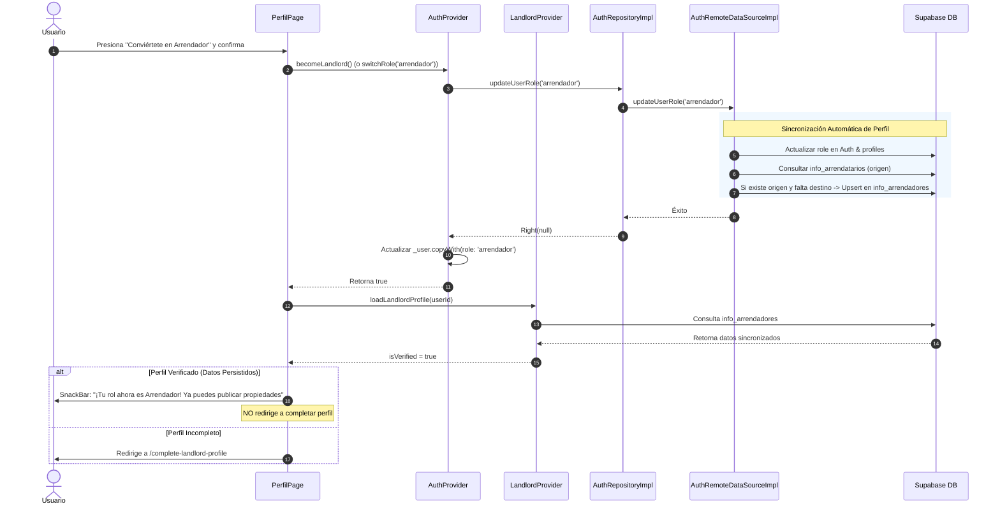

# Plan Técnico de Implementación: Persistencia de Datos al Cambiar Rol (007-vihomeapp-mvp)

Este documento define la arquitectura técnica, la estructura modular en capas (Clean Architecture), los modelos de datos, las decisiones técnicas justificadas y la estrategia de verificación automatizada para la **Persistencia y Sincronización de Datos al Cambiar Rol** en ViHome, en estricto cumplimiento de la [Constitución del Proyecto](docs/constitution.md) y de la especificación funcional [specs/007-vihomeapp-mvp/spec.md](specs/007-vihomeapp-mvp/spec.md).

---

## 1. Decisiones Técnicas Fundamentales (DT)

| ID | Decisión Técnica | Justificación Arquitectónica | Cobertura RF / CL |
| :--- | :--- | :--- | :--- |
| **DT-1** | **Sincronización Bidireccional de Perfiles en la Capa de Datos (`AuthRemoteDataSource` / `ProfileSyncDataSource`)** | ViHome almacena los datos de inquilinos en la tabla `info_arrendatarios` y los de propietarios en `info_arrendadores`, ambas indexadas por la clave primaria `id = user.id`. Al ejecutar `updateUserRole`, el sistema verifica si la tabla destino carece de datos y la tabla origen contiene un perfil completo; de ser así, propaga los datos de identidad de forma automática e idempotente vía `upsert`. | RF-37.1, RF-37.2, RF-37.3, CL-35 |
| **DT-2** | **Protección de Datos Preexistentes (Cero Sobrescritura con Nulos)** | Si la tabla destino ya cuenta con datos válidos, la sincronización solo complementa campos vacíos y nunca sobreescribe información existente con valores nulos o cadenas vacías. | RNF-23, CL-36 |
| **DT-3** | **Ampliación de Casos de Uso y Providers para Alternancia Bidireccional (`switchRole`)** | Se introduce el método `switchRole(String newRole)` en `AuthRepository`, `UpdateUserRoleUseCase` y `AuthProvider`, manteniendo los métodos de conveniencia `becomeLandlord()` y `becomeTenant()`. Al completar el cambio de rol, se recarga de inmediato el estado del nuevo provider (`LandlordProvider` o `TenantProvider`). | RF-37.1, RF-37.2, RF-40.1, RF-40.2 |
| **DT-4** | **Navegación Inteligente y Supresión de Redirección Forzosa en `PerfilPage`** | Tras el cambio de rol, `PerfilPage` evalúa si el perfil del nuevo rol ya cuenta con datos completos (`isVerified == true`). Si está verificado, **no redirige** a ninguna pantalla de completar datos y muestra el SnackBar de éxito correspondiente (*"¡Tu rol ahora es Arrendador! Ya puedes publicar propiedades"*). Solo si el perfil está incompleto se guía al usuario hacia el formulario respectivo. | RF-38.1, RF-38.2, RF-38.3, RF-39.1, RF-39.2 |
| **DT-5** | **Interfaz Simétrica de Cambio de Rol en `PerfilPage`** | Se añade la tarjeta interactiva de cambio de rol para usuarios con rol `arrendador` (*"Cambiar a rol Arrendatario"*), análoga a la existente para `arrendatario` (*"Conviértete en Arrendador"*), con diálogos de confirmación accesibles (`AlertDialogWidget`). | RF-40.1, RF-40.2, RF-40.3, RF-40.4 |
| **DT-6** | **Precarga Automática de Formularios de Perfil** | En `CompleteLandlordProfilePage` y `CompleteTenantProfilePage`, los campos del formulario se inicializan en `initState` con los datos del perfil actual o, si es nulo, con los datos del perfil del rol alterno disponible en los providers, eliminando la re-escritura manual. | RF-41.1, RF-41.2, RF-41.3, CL-32 |
| **DT-7** | **Manejo Resiliente de Perfil Inexistente en `LandlordRepositoryImpl`** | Se migra la consulta `.single()` a `.maybeSingle()` en `LandlordRepositoryImpl.getLandlordProfile` para evitar que PostgREST arroje excepciones no controladas cuando un usuario aún no posee registro en `info_arrendadores`, retornando un estado limpio y consistente. | RF-33.1, CL-32 |

---

## 2. Estructura de Módulos (Clean Architecture)

```
lib/
├── domain/
│   ├── entities/
│   │   ├── landlord.dart                          # [Extendido] Métodos de conversión/compatibilidad
│   │   └── tenant.dart                            # [Extendido] Métodos de conversión/compatibilidad
│   ├── repositories/
│   │   └── auth_repository.dart                   # [Extendido] Firma updateUserRole(String role)
│   └── usecases/
│       └── auth/
│           └── update_user_role_usecase.dart      # [Extendido] Soporte para alternancia completa
├── data/
│   ├── datasources/
│   │   └── auth_remote_datasource.dart            # [Extendido] Sincronización entre info_arrendatarios e info_arrendadores
│   └── repositories/
│       ├── auth_repository_impl.dart              # [Extendido] Implementación de cambio y sincronización
│       └── landlord_repository_impl.dart          # [Modificado] Uso de maybeSingle() para resiliencia
└── presentation/
    ├── providers/
    │   ├── auth_provider.dart                     # [Extendido] switchRole(role), becomeTenant(), becomeLandlord()
    │   ├── landlord_provider.dart                 # [Verificado] Carga reactiva de perfil sincronizado
    │   └── tenant_provider.dart                   # [Verificado] Carga reactiva de perfil sincronizado
    └── pages/
        ├── navegation/
        │   └── perfil_page.dart                   # [Modificado] Tarjeta simétrica y navegación inteligente
        ├── landlord/
        │   └── complete_landlord_profile_page.dart # [Modificado] Precarga de controladores
        └── tenant/
            └── complete_tenant_profile_page.dart   # [Modificado] Precarga de controladores
```

---

## 3. Modelo y Flujo de Sincronización de Datos

### Diagrama de Secuencia: Cambio de Rol con Sincronización Automática



---

## 4. Mapeo de Atributos entre Entidades

Tanto `Tenant` como `Landlord` comparten exactamente la misma estructura de datos personales en la base de datos de ViHome:

| Campo Base de Datos | Atributo `Tenant` | Atributo `Landlord` | Tipo | Regla de Sincronización |
| :--- | :--- | :--- | :--- | :--- |
| `id` | `id` | `id` | `String` (UUID) | Clave primaria compartida (`user.id`) |
| `primer_nombre` | `primerNombre` | `primerNombre` | `String` | Copia directa obligatoria |
| `segundo_nombre` | `segundoNombre` | `segundoNombre` | `String?` | Copia directa (preserva nulo si no existe) |
| `primer_apellido` | `primerApellido` | `primerApellido` | `String` | Copia directa obligatoria |
| `segundo_apellido` | `segundoApellido` | `segundoApellido` | `String?` | Copia directa (preserva nulo si no existe) |
| `tipo_documento` | `tipoDocumento` | `tipoDocumento` | `String` | Copia directa obligatoria ('CC', 'CE', 'PA') |
| `documento` | `documento` | `documento` | `String` | Copia directa obligatoria |
| `telefono_contacto`| `telefonoContacto`| `telefonoContacto`| `String` | Copia directa obligatoria |
| `direccion_contacto`| `direccionContacto`| `direccionContacto`| `String` | Copia directa obligatoria |
| `fcm_token` | `fcmToken` | `fcmToken` | `String?` | Preservado si existe |

---

## 5. Estrategia de Pruebas y Validación (TDD)

1. **Pruebas Unitarias de Capa Data:**
   - `test/data/datasources/auth_remote_datasource_role_switch_test.dart`: Verificar que al cambiar a `arrendador`, si existe registro en `info_arrendatarios`, se invoque el upsert correspondiente en `info_arrendadores` con los datos intactos, y viceversa para cambio a `arrendatario`.
   - `test/data/repositories/landlord_repository_maybe_single_test.dart`: Verificar que `getLandlordProfile` use `maybeSingle()` y maneje limpiamente perfiles inexistentes sin romper la aplicación.
2. **Pruebas Unitarias de Providers:**
   - `test/presentation/providers/auth_provider_switch_role_test.dart`: Validar el correcto flujo de `becomeLandlord()`, `becomeTenant()` y `switchRole(role)`.
3. **Pruebas de Widgets y Flujo de UI:**
   - `test/presentation/pages/profile/role_switch_persistence_test.dart`:
     - Validar que al cambiar a Arrendador con perfil completo, se muestre el SnackBar verde y **no** se redirija a `/complete-landlord-profile`.
     - Validar que aparezca el botón simétrico de "Cambiar a rol Arrendatario" cuando el usuario sea Arrendador.
     - Validar que al entrar a `CompleteLandlordProfilePage` o `CompleteTenantProfilePage`, los campos del formulario aparezcan precargados si existen datos previos.
4. **Pruebas de Regresión:**
   - Ejecutar la suite completa de pruebas del proyecto (`flutter test`) asegurando que las 306 pruebas preexistentes continúen pasando al 100%.
   - Ejecutar `flutter analyze` asegurando 0 advertencias o errores.

---

## 6. Matriz de Trazabilidad de Requerimientos

| Requisito Funcional | Criterio de Aceptación | Decisión Técnica | Archivo de Implementación | Prueba Automatizada |
| :--- | :--- | :--- | :--- | :--- |
| **RF-37.1, RF-37.2** | Escenario 1, Escenario 4 | DT-1, DT-2 | `auth_remote_datasource.dart` | `auth_remote_datasource_role_switch_test.dart` |
| **RF-38.1, RF-38.2** | Escenario 2 | DT-4 | `perfil_page.dart` | `role_switch_persistence_test.dart` |
| **RF-39.1, RF-39.2** | Escenario 3 | DT-3, DT-4 | `auth_provider.dart`, `perfil_page.dart` | `role_switch_persistence_test.dart` |
| **RF-40.1, RF-40.2, RF-40.3** | Escenario 4 | DT-5 | `perfil_page.dart` | `role_switch_persistence_test.dart` |
| **RF-41.1, RF-41.2** | Escenario 5 | DT-6 | `complete_landlord_profile_page.dart`, `complete_tenant_profile_page.dart` | `complete_profile_preload_test.dart` |
