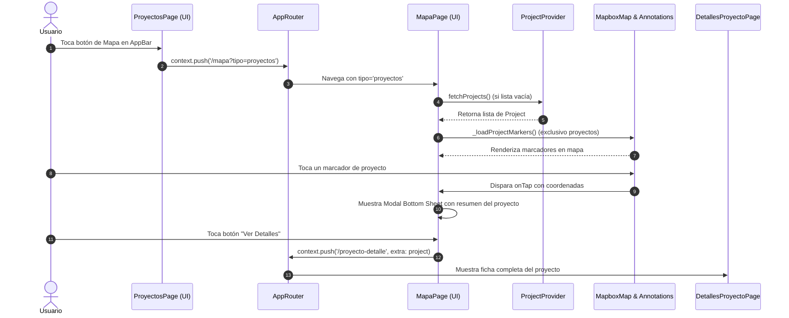

# Plan Técnico: Navegación a Mapa Exclusivo de Proyectos (008-vihomeapp-mvp)

## 1. Resumen Ejecutivo y Objetivos

Este plan define la solución técnica para habilitar la navegación desde la vista de proyectos hacia un mapa interactivo (Mapbox) filtrado de manera exclusiva para proyectos de construcción e inmobiliarios. La solución preserva la arquitectura limpia (Clean Architecture), aprovecha el `ProjectProvider` existente y extiende el enrutamiento con `go_router` para admitir parámetros de consulta (`queryParameters: {'tipo': 'proyectos'}`) en `/mapa`.

---

## 2. Decisiones Técnicas (DT)

- **DT-1: Extensión del Enrutamiento `/mapa` en `AppRouter` (`app_router.dart`)**
  - **Contexto:** Actualmente `/mapa` instancia `const MapaPage()` sin recibir parámetros.
  - **Decisión:** Modificar la ruta `/mapa` en `AppRouter` para extraer el parámetro opcional `tipo` tanto desde `state.uri.queryParameters['tipo']` como desde `(state.extra as Map?)?['tipo']`, pasándolo al constructor de `MapaPage(tipo: tipo)`.
  - **Beneficio:** Permite navegación declarativa URL-friendly (ej. `context.push('/mapa?tipo=proyectos')`) y compatibilidad hacia atrás cuando no se envían parámetros.

- **DT-2: Soporte Multimodal en `MapaPage` (`mapa_page.dart`)**
  - **Contexto:** `MapaPage` hoy consulta únicamente `PropertyProvider` y pinta marcadores para `Property`.
  - **Decisión:** 
    - Agregar el campo opcional `final String? tipo;` al widget `MapaPage`.
    - Crear getter `bool get isProjectsMode => widget.tipo?.toLowerCase() == 'proyectos';`.
    - Si `isProjectsMode == true`:
      - El título de la `AppBar` se establece en `'Mapa de Proyectos'`.
      - En `initState` (post-frame callback), se verifica `ProjectProvider.projects`; si está vacío, se invoca `fetchProjects()`.
      - En `_onMapCreated` y el botón de recarga (FAB), se invoca `_loadProjectMarkers()` en lugar de `_loadPropertyMarkers()`.
      - Al seleccionar una anotación en el mapa, se busca el `Project` por cercanía de coordenadas (`(p.lat - lat).abs() < 0.0001 && (p.lng - lng).abs() < 0.0001`) y se despliega `_showProjectDetails(project)`.
    - Si `isProjectsMode == false`:
      - Mantiene el comportamiento actual con `PropertyProvider` y `_loadPropertyMarkers()` sin ninguna alteración (cero regresiones).

- **DT-3: Marcadores Mapbox Personalizados para Proyectos**
  - **Decisión:**
    - Generar el marcador usando `Icons.domain` / `Icons.apartment` con color corporativo distintivo (ej. `primaryColor` o `Color(0xFF0F766E)`).
    - Etiqueta de texto debajo del icono: `precioDesde > 0 ? 'Desde ${currencyFormat.format(precioDesde)}' : 'Proyecto'`.
    - Key única en el estilo Mapbox: `'marker-project-${icon.codePoint}'`.

- **DT-4: Modal Bottom Sheet Especializado para Proyectos (`_showProjectDetails`)**
  - **Decisión:**
    - Renderizar:
      1. Título del proyecto (`project.ubicacionPrincipal` o `project.tipoPropiedad`).
      2. Dirección / Ubicación principal.
      3. Badge con el estado de obra (`project.estado`, ej. "Sobre Planos", "En Construcción").
      4. Chips de métricas: habitaciones (`${project.habitaciones} Hab`), baños (`${project.banos} Baños`), área (`${project.area} m²`).
      5. Sección de precio: etiqueta "Precio Desde" y valor formateado `currencyFormat.format(project.precioDesde)`.
      6. Botón de acción primario *"Ver Detalles"* que ejecuta:
         ```dart
         Navigator.pop(context);
         context.push('/proyecto-detalle', extra: project);
         ```

- **DT-5: Botón de Acceso en la AppBar de `ProyectosPage` (`proyectos_page.dart`)**
  - **Decisión:**
    - En la `AppBar.actions` de `ProyectosPage`, anteponer a la campana de notificaciones un `IconButton`:
      ```dart
      IconButton(
        icon: const Icon(Icons.map_outlined, color: Colors.black),
        tooltip: 'Ver Proyectos en Mapa',
        onPressed: () {
          context.push('/mapa?tipo=proyectos');
        },
      ),
      ```
    - Accesibilidad total con `tooltip: 'Ver Proyectos en Mapa'`.

- **DT-6: Resiliencia ante Coordenadas Cero o Incompletas (CL-38, CL-39)**
  - **Decisión:**
    - Filtrar en el bucle de marcadores: `if (project.lat != 0 && project.lng != 0)`.
    - Manejo seguro de listas vacías y captura de errores sin crashes.

---

## 3. Arquitectura y Mapeo de Capas (Clean Architecture)

```
lib/
├── core/
│   └── router/
│       └── app_router.dart                     // Modificado: GoRoute('/mapa') recibe queryParam 'tipo'
├── presentation/
│   ├── pages/
│   │   ├── proyectos/
│   │   │   └── proyectos_page.dart             // Modificado: Añade IconButton de mapa en AppBar
│   │   └── navegation/
│   │       └── mapa_page.dart                  // Modificado: Soporte isProjectsMode, marcadores y modal de Project
│   └── providers/
│       └── project_provider.dart               // Reutilizado: fetchProjects(), projects
```

---

## 4. Diagrama de Secuencia



---

## 5. Estrategia de Pruebas

1. **Pruebas de Router (`app_router_mapa_query_param_test.dart`):**
   - Validar que `/mapa?tipo=proyectos` configure `MapaPage` con `tipo == 'proyectos'`.
   - Validar que `/mapa` sin parámetros configure `tipo == null`.
2. **Pruebas de Widget en `ProyectosPage` (`proyectos_page_map_button_test.dart`):**
   - Comprobar la existencia del `IconButton` con tooltip `'Ver Proyectos en Mapa'`.
   - Verificar la navegación al pulsar el botón.
3. **Pruebas de Componente y Lógica en `MapaPage` (`mapa_page_projects_mode_test.dart`):**
   - Validar el título dinámico `'Mapa de Proyectos'`.
   - Validar que `ProjectProvider.fetchProjects()` se invoque en modo proyectos.
   - Validar que se omitan marcadores con latitud/longitud en cero (CL-38).
   - Validar la visualización del modal resumen de proyecto y el botón "Ver Detalles".
4. **Regresión Completa:**
   - Correr la totalidad de pruebas del repositorio asegurando 0 regresiones.
   - Correr `flutter analyze` asegurando 0 issues.
